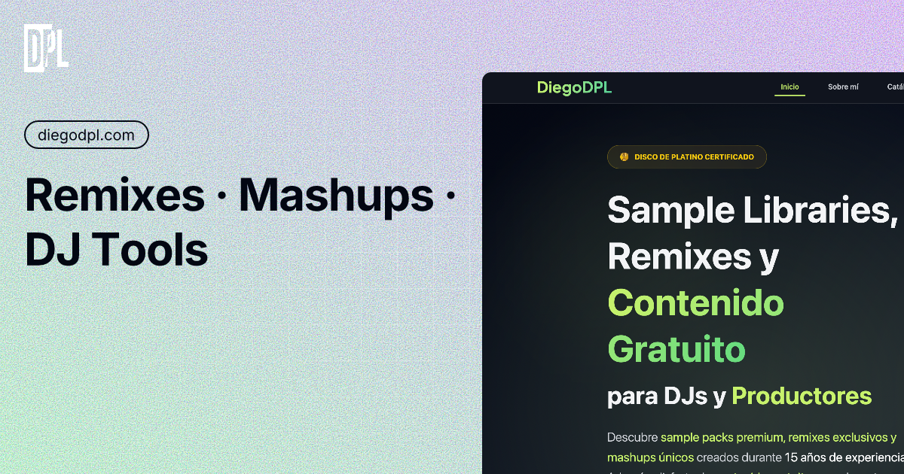

<div align="center">

# 🎵 DiegoDPL Shop

[]()
[](https://reactjs.org/)
[](https://www.typescriptlang.org/)
[](https://vitejs.dev/)
[](https://firebase.google.com/)
[](https://tailwindcss.com/)
[](LICENSE)

**Professional music e-commerce platform for DJs, producers and music lovers**

*Discover exclusive sample libraries, premium beats, and professional remixes from a platinum-certified producer*

[🚀 Live Demo](https://diegodpl.com) • [📖 Documentation](#-documentation) • [🐛 Report Bug](https://github.com/Diego-DPL/DiegoDPLShop/issues) • [✨ Request Feature](https://github.com/Diego-DPL/DiegoDPLShop/issues)

</div>

---

## 🎯 **About the Project**

**DiegoDPLShop** is a cutting-edge e-commerce platform built for the music industry, specifically designed for selling digital music products like sample libraries, beats, remixes, and exclusive content. Built by **DiegoDPL**, a platinum-certified music producer with over 15 years of experience.

### ✨ **Why DiegoDPLShop?**

- 🏆 **Platinum-Certified Quality** - Backed by real industry success
- 🎵 **Premium Audio Experience** - Built-in audio previews with professional controls
- 📱 **Mobile-First Design** - Optimized for all devices and screen sizes
- 🔒 **Secure & Fast** - Firebase backend with enterprise-grade security
- 🎨 **Glassmorphism UI** - Modern, beautiful interface with premium aesthetics
- 📧 **Automated Delivery** - Instant digital downloads via email automation

---

## 🚀 **Key Features**

<table>
<tr>
<td width="50%">

### 🎵 **Music Commerce**
- ✅ **Digital Product Sales** - Sample packs, beats, remixes
- ✅ **Audio Previews** - Advanced playback controls with seek
- ✅ **Free Content** - Weekly free downloads for community
- ✅ **Smart Categorization** - Genre, style, and mood filtering
- ✅ **Instant Downloads** - Automated email delivery system

### 🔐 **Authentication & Security**
- ✅ **Firebase Auth** - Google, email/password login
- ✅ **Role-Based Access** - Admin, artist, customer levels
- ✅ **Secure Checkout** - Stripe integration ready
- ✅ **Email Verification** - Mailgun-powered notifications
- ✅ **Download Protection** - Secure, expiring links

</td>
<td width="50%">

### 📱 **User Experience**
- ✅ **Responsive Design** - Perfect on mobile, tablet, desktop
- ✅ **Dark Theme** - Professional DJ/producer aesthetic
- ✅ **Advanced Search** - Real-time filtering and search
- ✅ **Cart Management** - Persistent shopping cart
- ✅ **Purchase History** - Order tracking and re-downloads

### 🚀 **Technical Excellence**
- ✅ **TypeScript** - Type-safe development
- ✅ **React 19** - Latest React features
- ✅ **Vite Build** - Lightning-fast dev and production builds
- ✅ **SEO Optimized** - Schema.org, Open Graph, Twitter Cards
- ✅ **PWA Ready** - Progressive Web App capabilities

</td>
</tr>
</table>

---

## 🛠️ **Technology Stack**

<div align="center">

| **Frontend** | **Backend** | **Services** | **Tools** |
|:---:|:---:|:---:|:---:|
|  |  |  |  |
|  |  |  |  |
|  |  |  |  |

</div>

---

## 🎥 **Screenshots & Demo**

<div align="center">

### 🏠 **Home Page**

*Hero section showcasing DiegoDPL's platinum-certified achievements*

### 🎵 **Music Catalog**
*Professional music browser with audio previews and advanced filtering*

### 🛒 **Shopping Experience**
*Seamless cart management and checkout process*

</div>

---

## ⚡ **Quick Start**

### 📋 **Prerequisites**

- **Node.js** 18.0.0 or higher
- **npm** 8.0.0 or higher
- **Git**
- **Firebase Project** (free tier available)
- **Mailgun Account** (free tier: 5,000 emails/month)

### 🚀 **Installation**

```bash
# Clone the repository
git clone https://github.com/Diego-DPL/DiegoDPLShop.git

# Navigate to project directory
cd DiegoDPLShop

# Install dependencies
npm install

# Copy environment variables
cp .env.example .env

# Configure your environment variables (see Configuration section)
nano .env

# Start development server
npm run dev
```

**🎉 Your app will be running at `http://localhost:5173`**

### ⚙️ **Configuration**

Create a `.env` file in the root directory with the following variables:

```env
# Firebase Configuration
VITE_FIREBASE_API_KEY=your_firebase_api_key
VITE_FIREBASE_AUTH_DOMAIN=your_project.firebaseapp.com
VITE_FIREBASE_PROJECT_ID=your_project_id
VITE_FIREBASE_STORAGE_BUCKET=your_project.appspot.com
VITE_FIREBASE_MESSAGING_SENDER_ID=your_sender_id
VITE_FIREBASE_APP_ID=your_app_id

# Mailgun Configuration
VITE_MAILGUN_API_KEY=key-your_mailgun_api_key
VITE_MAILGUN_DOMAIN=your_mailgun_domain
VITE_FROM_EMAIL=noreply@your_domain.com

# Stripe Configuration (Optional)
VITE_STRIPE_PUBLISHABLE_KEY=pk_test_your_stripe_key
```

<details>
<summary>📖 <strong>Detailed Configuration Guide</strong></summary>

### Firebase Setup
1. Create a new project at [Firebase Console](https://console.firebase.google.com/)
2. Enable Authentication, Firestore, and Storage
3. Copy your config keys to `.env`

### Mailgun Setup  
1. Sign up at [Mailgun](https://www.mailgun.com/) (free tier available)
2. Verify your domain or use sandbox domain
3. Get your API key and domain from dashboard

### Stripe Setup (Optional)
1. Create account at [Stripe](https://stripe.com/)
2. Get your publishable key from dashboard
3. Configure webhooks for payment processing

</details>

---

## 📱 **Available Scripts**

| Command | Description |
|---------|-------------|
| `npm run dev` | 🔥 Start development server with hot reload |
| `npm run build` | 📦 Build production-ready application |
| `npm run preview` | 👁️ Preview production build locally |
| `npm run lint` | 🔍 Run ESLint for code quality |

---

## 🏗️ **Project Structure**

```
📦 DiegoDPLShop/
├── 📁 public/                    # Static assets
│   ├── 🖼️ favicon.ico           # Site favicon  
│   ├── 🖼️ og-image.png          # Social media preview
│   ├── 📄 robots.txt            # SEO crawler directives
│   ├── 🗺️ sitemap.xml           # SEO sitemap
│   └── 📱 site.webmanifest      # PWA configuration
├── 📁 src/
│   ├── 📁 components/           # Reusable UI components
│   │   ├── 🔔 Notification.tsx  # Toast notifications
│   │   └── 📁 layout/           # Layout components
│   ├── 📁 context/              # React Context providers
│   │   ├── 🔐 AuthContext.tsx   # Authentication state
│   │   └── 🛒 CartContext.tsx   # Shopping cart state
│   ├── 📁 hooks/                # Custom React hooks
│   │   └── ⬇️ useSecureDownload.ts # Secure file downloads
│   ├── 📁 lib/                  # External library configurations
│   │   └── 🔥 firebase.ts       # Firebase configuration
│   ├── 📁 pages/                # Application pages/routes
│   │   ├── 🏠 Home.tsx          # Landing page
│   │   ├── 🎵 Catalog.tsx       # Music catalog browser
│   │   ├── 🛒 Cart.tsx          # Shopping cart
│   │   ├── 💳 Checkout.tsx      # Purchase flow
│   │   ├── 👤 Account.tsx       # User account
│   │   ├── ⚙️ Admin.tsx         # Admin panel
│   │   └── 📄 About.tsx         # About page
│   ├── 📁 utils/                # Utility functions
│   │   ├── 📧 email.ts          # Email automation
│   │   ├── 🛍️ products.ts       # Product management
│   │   ├── 👥 user.ts           # User utilities
│   │   └── 📊 orders.ts         # Order processing
│   ├── 📁 assets/               # Images and media
│   ├── 🎨 App.css               # Global styles
│   ├── ⚛️ App.tsx               # Main App component
│   └── 🏁 main.tsx              # Application entry point
├── 📄 package.json              # Dependencies and scripts
├── ⚙️ vite.config.ts            # Vite configuration
├── 🎨 tailwind.config.js        # TailwindCSS configuration
├── 📝 tsconfig.json             # TypeScript configuration
└── 📚 README.md                 # You are here!
```

---

## 🎵 **Music Industry Features**

### 🎧 **Audio Experience**
- **Professional Audio Player** - Custom-built with glassmorphism design
- **Seek Functionality** - Precise audio scrubbing and seeking
- **Volume Control** - Professional mixing board style controls
- **Waveform Display** - Visual audio representation (coming soon)

### 🎼 **Product Management**
- **Sample Libraries** - Organized collections of professional samples
- **Beat Sales** - Individual beat purchases with stems
- **Remix Collections** - Exclusive remixes and edits
- **Free Downloads** - Weekly community content

### 📊 **Analytics & Insights**
- **Download Tracking** - Monitor popular content
- **User Analytics** - Understand your audience
- **Sales Reports** - Track revenue and trends
- **Email Metrics** - Monitor delivery and engagement

---

## 🔒 **Security & Performance**

### 🛡️ **Security Features**
- ✅ **Firebase Security Rules** - Database and storage protection
- ✅ **Authentication Guards** - Route-level protection
- ✅ **Input Validation** - Client and server-side validation
- ✅ **Secure Downloads** - Time-limited, authenticated links
- ✅ **HTTPS Enforcement** - Encrypted data transmission

### ⚡ **Performance Optimizations**
- ✅ **Code Splitting** - Lazy-loaded routes and components
- ✅ **Image Optimization** - WebP format with fallbacks
- ✅ **Caching Strategy** - Smart asset caching
- ✅ **Bundle Analysis** - Optimized build sizes
- ✅ **Core Web Vitals** - Google PageSpeed optimized

### 📈 **SEO Excellence**
- ✅ **Schema.org Markup** - Rich snippets for music products
- ✅ **Open Graph** - Perfect social media previews
- ✅ **Twitter Cards** - Enhanced tweet appearances
- ✅ **Sitemap Generation** - Automatic SEO sitemap
- ✅ **Robots.txt** - Search engine optimization

---

## 📖 **Documentation**

<details>
<summary>🔧 <strong>Advanced Configuration</strong></summary>

### Firebase Rules Configuration
```javascript
// Firestore Security Rules
rules_version = '2';
service cloud.firestore {
  match /databases/{database}/documents {
    // Admin-only access to admin functions
    match /admin/{document=**} {
      allow read, write: if isAdmin();
    }
    
    // Product catalog - public read, admin write
    match /products/{productId} {
      allow read: if true;
      allow write: if isAdmin();
    }
    
    // User orders - user can read their own
    match /orders/{orderId} {
      allow read: if isOwner() || isAdmin();
      allow create: if isAuthenticated();
    }
  }
}
```

### Email Template Customization
```typescript
// src/utils/email.ts
export const createDownloadEmailHTML = (data: EmailData): string => {
  return `
    <div style="font-family: Arial, sans-serif; max-width: 600px; margin: 0 auto;">
      <div style="background: linear-gradient(135deg, #84cc16, #a3e635); padding: 30px; text-align: center;">
        <h1 style="color: white; margin: 0;">¡Thanks for your purchase!</h1>
      </div>
      <!-- Customize your email template here -->
    </div>
  `;
};
```

</details>

<details>
<summary>🚀 <strong>Deployment Guide</strong></summary>

### Vercel Deployment
1. Connect your GitHub repository to Vercel
2. Configure environment variables in Vercel dashboard
3. Deploy automatically on every push to main branch

### Custom Domain Setup
1. Add your domain in Vercel dashboard
2. Configure DNS records
3. Enable SSL certificate

### Production Checklist
- [ ] Environment variables configured
- [ ] Firebase rules updated for production
- [ ] Mailgun domain verified
- [ ] Stripe webhooks configured
- [ ] Analytics tracking enabled

</details>

---

## 🤝 **Contributing**

We love contributions! Here's how you can help make DiegoDPLShop even better:

### 🐛 **Bug Reports**
Found a bug? Please open an issue with:
- Clear description of the problem
- Steps to reproduce
- Expected vs actual behavior
- Screenshots if applicable

### ✨ **Feature Requests**
Have an idea? We'd love to hear it! Please include:
- Detailed description of the feature
- Use case and benefits
- Any implementation ideas

### 💻 **Code Contributions**

```bash
# Fork the repository
# Create a feature branch
git checkout -b feature/amazing-feature

# Make your changes
# Commit your changes
git commit -m 'Add some amazing feature'

# Push to the branch
git push origin feature/amazing-feature

# Open a Pull Request
```

### 📋 **Development Guidelines**
- Follow TypeScript best practices
- Use semantic commit messages
- Add tests for new features
- Update documentation as needed
- Ensure all builds pass

---

## 📄 **License**

This project is licensed under the **MIT License** - see the [LICENSE](LICENSE) file for details.

---

## 👨‍💻 **About the Developer**

<div align="center">

### **DiegoDPL** 
*Platinum-Certified Music Producer & Full-Stack Developer*

🏆 **Disco de Platino** with "La Historia" (Lorena Santos)  
🎵 **15+ Years** of music industry experience  
💻 **Full-Stack Developer** with modern web technologies  

[](https://diegodpl.com)
[](https://instagram.com/DiegoDPL)
[](https://github.com/Diego-DPL)

*"Bridging the gap between music and technology"*

</div>

---

## 🙏 **Acknowledgments**

- **React Team** - For the amazing framework
- **Vercel** - For excellent hosting and deployment
- **Firebase** - For robust backend infrastructure  
- **TailwindCSS** - For the utility-first CSS framework
- **Music Community** - For inspiration and feedback

---

## 📞 **Support**

Need help? Have questions? We're here for you!

- 📧 **Email**: [info@diegodpl.com](mailto:info@diegodpl.com)
- 🐛 **Issues**: [GitHub Issues](https://github.com/Diego-DPL/DiegoDPLShop/issues)
- 💬 **Discussions**: [GitHub Discussions](https://github.com/Diego-DPL/DiegoDPLShop/discussions)

---

<div align="center">

**Made with ❤️ by [DiegoDPL](https://github.com/Diego-DPL)**

⭐ **Star this repository if you found it helpful!**

[](https://github.com/Diego-DPL/DiegoDPLShop/stargazers)
[](https://github.com/Diego-DPL/DiegoDPLShop/network/members)

</div>

---

## 📋 Descripción

**DiegoDPLShop** es el proyecto de tienda digital de DiegoDPL (productor musical / artista). En esta web podrás:

- Conocer al artista (“Sobre mí”).
- Explorar y escuchar previews de los bundles de sonido.
- Añadir bundles al carrito y pagar mediante Stripe.
- Descargar automáticamente los contenidos digitales después de la compra.
- Suscribirte a un newsletter y seguir las redes sociales del proyecto.

El front-end está construido con **Vite** y **React**, estilizado con **TailwindCSS**. Para los pagos se utiliza **Stripe Checkout** a través de una función serverless (Vercel Functions). Actualmente, el despliegue se realiza en **Vercel** (branch `main` → producción).

---

## 🚀 Tecnologías principales

- **Vite (React)**: Bundler ultrarrápido para desarrollo y build.
- **React 18**: Biblioteca para interfaces de usuario.
- **TailwindCSS**: Framework de estilos utilitarios.
- **React Router v6**: Enrutado en cliente para páginas (Home, Bundles, Carrito, Checkout, etc.).
- **Stripe Checkout**: Pasarela de pago para compras de los bundles.
- **Context API (React)**: Gestión global del estado del carrito de compras.
- **Vercel Functions**: Endpoint Serverless en `src/api/checkout-session.js` para crear sesiones de Stripe.
- **Vercel**: Plataforma de hosting (front + backend serverless).

---

## 📂 Estructura de carpetas

```
📦 DiegoDPLShop
├─ .gitignore
├─ package.json
├─ vite.config.js
├─ postcss.config.cjs
├─ tailwind.config.cjs
├─ public/
│   ├─ favicon.ico
│   └─ assets/               # Imágenes estáticas (logos, fotos del artista, portadas de bundles, previews)
│       ├─ bundle-1.jpg
│       ├─ bundle-2.jpg
│       └─ …
├─ src/
│   ├─ index.css             # Importación de Tailwind (“@tailwind base; @tailwind components; @tailwind utilities;”)
│   ├─ main.jsx              # Punto de entrada: ReactDOM.render + <CartProvider> + <App />
│   ├─ App.jsx               # Configuración de React Router + <Layout> (Navbar + Footer)
│   ├─ vite-env.d.ts         # Tipos de Vite (si usas TypeScript)
│   ├─ api/
│   │   └─ checkout-session.js  # Función serverless en Vercel para crear Stripe Checkout Sessions
│   ├─ components/           # Componentes reutilizables (UI)
│   │   ├─ Layout.jsx        # Contenedor general (Navbar + Footer + <main>)
│   │   ├─ Navbar.jsx        # Barra superior: logo, enlaces, icono carrito
│   │   ├─ Footer.jsx        # Pie de página: enlaces rápidos, redes, suscripción
│   │   ├─ BundleCard.jsx    # Tarjeta de producto (imagen, nombre, precio, botón “Ver más”)
│   │   ├─ CartItem.jsx      # Item individual dentro del carrito
│   │   └─ …
│   ├─ context/
│   │   └─ CartContext.jsx   # React Context para estado global del carrito (add, remove, clear, totalPrice)
│   ├─ pages/                # Páginas de React Router (vistas)
│   │   ├─ Home.jsx          # Página de aterrizaje (“Bienvenido a DiegoDPLShop”)
│   │   ├─ Bundles.jsx       # Listado de todos los bundles
│   │   ├─ BundleDetail.jsx  # Detalle individual de un bundle (params: id)
│   │   ├─ Cart.jsx          # Vista del carrito de compra
│   │   ├─ Checkout.jsx      # Página de confirmación de compra (llama a la API /api/checkout-session)
│   │   ├─ Success.jsx       # Página a la que Stripe redirige tras pago exitoso
│   │   └─ NotFound.jsx      # Página 404 (opcional)
│   ├─ utils/
│   │   └─ stripe.js         # Cliente de Stripe en front (loadStripe con VITE_STRIPE_PUBLISHABLE_KEY)
│   └─ data/                 # (Opcional) Datos estáticos de ejemplo (JSON con info de bundles)
│       └─ bundles.json
└─ README.md                 # ← (Este archivo)
```

---

## ⚙️ Configuración e instalación

### 1. Clonar el repositorio

```bash
git clone https://github.com/Diego-DPL/DiegoDPLShop.git
cd DiegoDPLShop
```

### 2. Instalar dependencias

Asegúrate de tener instalado **Node.js v16+** (recomendado) y npm (o Yarn).

```bash
npm install
# ó, si usas Yarn:
# yarn
```

### 3. Variables de entorno

Crea un fichero llamado `.env` en la raíz (no subirlo a GitHub). Incluye tus claves de Stripe (test o live):

```ini

```

- **VITE_STRIPE_PUBLISHABLE_KEY**: clave pública de Stripe (prefijo `VITE_` para exponerla en el cliente).
- **STRIPE_SECRET_KEY**: clave secreta de Stripe, usada solo en el backend (Vercel Functions).
  ⚠️ Nunca expongas tu clave secreta en el front-end.

### 4. Scripts disponibles

```bash
# Modo desarrollo (hot-reload en http://localhost:5173/)
npm run dev

# Construcción para producción (genera /dist)
npm run build

# Vista previa de la build local
npm run preview
```

- `npm run dev`: arranca Vite en modo “watch” y recarga al guardar cambios.
- `npm run build`: transpila y empaqueta todo en `/dist`. Ideal para Vercel.
- `npm run preview`: sirve localmente el contenido de `/dist` para pruebas.

---

## 💻 Uso local

1. **Arranca el servidor de desarrollo**:

   ```bash
   npm run dev
   ```

2. Abre tu navegador en `http://localhost:5173/`. Deberías ver:

   - El **Header** con logo “DiegoDPL” y menú: Inicio, Sobre mí, Bundles, Carrito.
   - La **Home** con presentación del proyecto y CTA “Ver Bundles”.
   - La página de **Bundles** (con datos de ejemplo o fijos).
   - La página de **BundleDetail** (detalle de cada bundle, “Añadir al carrito”).
   - El **Carrito** (Cart.jsx) que muestra items añadidos y total.
   - El **Checkout** (Checkout.jsx) que, al hacer clic en “Pagar con Stripe”, crea una Checkout Session y redirige a Stripe.
   - La página **Success** una vez completado el pago.

3. Si quieres probar el **flow de Stripe** (modo test), añade un artículo al carrito, ve a “Checkout” y utiliza uno de los números de tarjeta de prueba de Stripe (por ejemplo, `4242 4242 4242 4242`, MM/AA válido, CVC `123`).

---

## 🔧 Configuración de Stripe (Vercel)

Cuando despliegues en Vercel (branch `main` → producción), define las variables de entorno en la sección **Settings → Environment Variables**:

- **VITE_STRIPE_PUBLISHABLE_KEY** = tu clave pública (por ejemplo `pk_live_…` o `pk_test_…`).
- **STRIPE_SECRET_KEY** = tu clave secreta (por ejemplo `sk_live_…` o `sk_test_…`).

Vercel detecta automáticamente los archivos en `src/api/*.js` y los expone bajo `/api/[nombre]`. Por ejemplo:

- `src/api/checkout-session.js` → `https://<TU_DOMINIO>.vercel.app/api/checkout-session`

Nuestro front (Checkout.jsx) hace `fetch("/api/checkout-session", ...)`, que Vercel ejecuta la función y devuelve `session.id`. Asegúrate de usar las variables de entorno con el mismo nombre exacto (`process.env.STRIPE_SECRET_KEY` en serverless, `import.meta.env.VITE_STRIPE_PUBLISHABLE_KEY` en front).

---

## 📄 Estructura y componentes clave

A modo de resumen, estos son los elementos más importantes del código:

- **`src/main.jsx`**  
  ```jsx
  import React from "react";
  import ReactDOM from "react-dom/client";
  import "./index.css";          # Tailwind
  import App from "./App";
  import { CartProvider } from "./context/CartContext";

  ReactDOM.createRoot(document.getElementById("root")).render(
    <React.StrictMode>
      <CartProvider>
        <App />
      </CartProvider>
    </React.StrictMode>
  );
  ```

- **`src/App.jsx`**  
  Define rutas con React Router y el `Layout` global.
  ```jsx
  import { BrowserRouter, Routes, Route } from "react-router-dom";
  import Layout from "./components/Layout";
  import Home from "./pages/Home";
  import Bundles from "./pages/Bundles";
  import BundleDetail from "./pages/BundleDetail";
  import Cart from "./pages/Cart";
  import Checkout from "./pages/Checkout";
  import Success from "./pages/Success";
  import NotFound from "./pages/NotFound";

  function App() {
    return (
      <BrowserRouter>
        <Layout>
          <Routes>
            <Route path="/" element={<Home />} />
            <Route path="/bundles" element={<Bundles />} />
            <Route path="/bundles/:id" element={<BundleDetail />} />
            <Route path="/cart" element={<Cart />} />
            <Route path="/checkout" element={<Checkout />} />
            <Route path="/success" element={<Success />} />
            <Route path="*" element={<NotFound />} />
          </Routes>
        </Layout>
      </BrowserRouter>
    );
  }

  export default App;
  ```

- **`src/context/CartContext.jsx`**  
  Contexto para almacenar `cartItems`, funciones: `addToCart`, `removeFromCart`, `clearCart`, `totalPrice`.

- **`src/api/checkout-session.js`**  
  Función serverless de Vercel para crear la sesión de Stripe:  
  ```js
  import Stripe from "stripe";

  // Clave secreta en producción (Vercel env)
  const stripe = new Stripe(process.env.STRIPE_SECRET_KEY);

  export default async function handler(req, res) {
    if (req.method === "POST") {
      try {
        const { items } = req.body;

        const line_items = items.map(item => ({
          price_data: {
            currency: "eur",
            product_data: {
              name: item.name,
              images: [item.imageUrl],
            },
            unit_amount: Math.round(item.price * 100),
          },
          quantity: item.quantity,
        }));

        const session = await stripe.checkout.sessions.create({
          payment_method_types: ["card"],
          line_items,
          mode: "payment",
          success_url: `${req.headers.origin}/success?session_id={CHECKOUT_SESSION_ID}`,
          cancel_url: `${req.headers.origin}/cart`,
        });

        return res.status(200).json({ id: session.id });
      } catch (error) {
        console.error("Stripe checkout error:", error);
        return res.status(500).json({ error: "Error al crear la sesión de Stripe" });
      }
    } else {
      res.setHeader("Allow", "POST");
      return res.status(405).json({ error: "Método no permitido" });
    }
  }
  ```

- **`src/utils/stripe.js`**  
  Inicializa Stripe en el cliente:  
  ```js
  import { loadStripe } from "@stripe/stripe-js";
  let stripePromise = null;

  export function getStripe() {
    if (!stripePromise) {
      stripePromise = loadStripe(import.meta.env.VITE_STRIPE_PUBLISHABLE_KEY);
    }
    return stripePromise;
  }
  ```

- **`src/pages/Checkout.jsx`**  
  Envía el carrito al endpoint y redirige a Stripe:  
  ```jsx
  import { useCart } from "../context/CartContext";
  import { getStripe } from "../utils/stripe";
  import { useEffect, useState } from "react";
  import { useNavigate } from "react-router-dom";

  export default function Checkout() {
    const { cartItems, clearCart, totalPrice } = useCart();
    const [loading, setLoading] = useState(false);
    const navigate = useNavigate();

    useEffect(() => {
      if (cartItems.length === 0) {
        navigate("/bundles");
      }
    }, [cartItems, navigate]);

    const handleCheckout = async () => {
      setLoading(true);
      try {
        const itemsForApi = cartItems.map(item => ({
          id: item.id,
          name: item.name,
          price: item.price,
          quantity: item.quantity,
          imageUrl: item.imageUrl,
        }));

        const response = await fetch("/api/checkout-session", {
          method: "POST",
          headers: { "Content-Type": "application/json" },
          body: JSON.stringify({ items: itemsForApi }),
        });

        const { id: sessionId } = await response.json();
        const stripe = await getStripe();
        await stripe.redirectToCheckout({ sessionId });
      } catch (error) {
        console.error("Error al crear la sesión de checkout:", error);
        setLoading(false);
      }
    };

    return (
      <div className="max-w-xl mx-auto">
        <h2 className="text-3xl font-bold mb-6">Confirmar Compra</h2>
        <p className="mb-4">Total a pagar: <span className="font-semibold">{totalPrice.toFixed(2)} €</span></p>
        <button
          onClick={handleCheckout}
          disabled={loading}
          className={`w-full text-center ${
            loading ? "bg-gray-400" : "bg-green-600 hover:bg-green-700"
          } text-white px-4 py-3 rounded`}
        >
          {loading ? "Procesando..." : "Pagar con Stripe"}
        </button>
      </div>
    );
  }
  ```

- **`src/pages/Success.jsx`**  
  Página final que vacía el carrito y muestra mensaje de éxito.

---

## 🔍 Modo Producción

1. **Build**  
   ```bash
   npm run build
   ```  
   Crea la carpeta `dist/` con todos los archivos optimizados.

2. **Deploy en Vercel**  
   - Ve a [vercel.com](https://vercel.com/) y conecta tu repositorio GitHub.  
   - Vercel detectará automáticamente que es un proyecto Vite (build command: `npm run build`; output: `dist`).  
   - Agrega las mismas variables de entorno en **Settings > Environment Variables**:  
     - `VITE_STRIPE_PUBLISHABLE_KEY`  
     - `STRIPE_SECRET_KEY`  
   - Despliega con **Deploy**.  
   - Tras unos segundos, tendrás la URL de producción:  
     ```
     https://diegodplshop.vercel.app
     ```

---

## 📐 Estructura de carpetas (resumen)

```plaintext
DiegoDPLShop/
├─ .gitignore
├─ .env.example            # Ejemplo de variables de entorno (sin claves reales)
├─ package.json
├─ vite.config.js
├─ postcss.config.cjs
├─ tailwind.config.cjs
├─ public/
│   ├─ favicon.ico
│   └─ assets/
│       ├─ bundle-1.jpg
│       ├─ bundle-2.jpg
│       └─ …
├─ src/
│   ├─ index.css
│   ├─ main.jsx
│   ├─ App.jsx
│   ├─ vite-env.d.ts
│   ├─ api/
│   │   └─ checkout-session.js
│   ├─ components/
│   │   ├─ Layout.jsx
│   │   ├─ Navbar.jsx
│   │   ├─ Footer.jsx
│   │   ├─ BundleCard.jsx
│   │   ├─ CartItem.jsx
│   │   └─ …
│   ├─ context/
│   │   └─ CartContext.jsx
│   ├─ pages/
│   │   ├─ Home.jsx
│   │   ├─ Bundles.jsx
│   │   ├─ BundleDetail.jsx
│   │   ├─ Cart.jsx
│   │   ├─ Checkout.jsx
│   │   ├─ Success.jsx
│   │   └─ NotFound.jsx
│   ├─ utils/
│   │   └─ stripe.js
│   └─ data/                # (Opcional) JSON de ejemplo: bundles.json
│       └─ bundles.json
└─ README.md                # ← (Este archivo)
```

---

## 🛠 Detalles y buenas prácticas

- **Variables de entorno**:  
  - Usa un fichero `.env` local en desarrollo.  
  - Nunca subas tu clave secreta (`STRIPE_SECRET_KEY`) al repositorio.  
  - En Vercel, configura las variables en **Settings → Environment Variables**.  

- **Imágenes / Bundles**:  
  - Guarda las portadas de los bundles y previews en `public/assets/`.  
  - Si crece el catálogo, considera usar un bucket (S3 / Cloud Storage) y un CMS para gestionar productos.  

- **Gestión de estado**:  
  - El carrito se maneja con React Context (`CartContext.jsx`).  
  - Para casos más complejos, podrías migrar a Redux, Zustand o Recoil, pero por ahora Context es suficiente.  

- **Stripe Checkout**:  
  - Se utiliza “serverless functions” (`src/api/checkout-session.js`) para no exponer lógica ni claves en el cliente.  
  - El front llama a `fetch("/api/checkout-session")`, Vercel ejecuta la función y devuelve `session.id`.  
  - Luego `stripe.redirectToCheckout({ sessionId })` redirige al checkout de Stripe.  

- **Patrones de diseño**:  
  - **Atomic Components**: cada componente en `src/components/` es “composable” y estilizado con Tailwind.  
  - **Pages vs. Components**: separa las vistas completas (pages) de los componentes reutilizables.  

- **Accesibilidad (A11y)**:  
  - Agrega `alt` descriptivos en todas las imágenes.  
  - Usa roles ARIA en elementos interactivos (menú, botones, etc.).  
  - Asegura contraste suficiente en texto sobre fondos oscuros.  

- **SEO Básico**:  
  - Asegura que cada página tenga `<meta>` y `<title>` descriptivos (puedes usar React Helmet u otro paquete en el futuro).  
  - Estructura semántica: usa etiquetas `<header>`, `<main>`, `<section>`, `<footer>` en el layout.  

---

## 🤝 Contribuir

Si quieres colaborar con mejoras, sigue estos pasos:

1. Haz fork de este repositorio.  
2. Crea una rama feature / fix:  
   ```bash
   git checkout -b feat/nueva-funcionalidad
   ```  
3. Realiza tus cambios, crea commits claros y descriptivos.  
4. Haz push a tu fork y abre un Pull Request describiendo la funcionalidad o corrección.  
5. Espera revisión y aprobación.  

---

## 📝 Licencia

Este proyecto está bajo la licencia **MIT License**. Consulta [LICENSE](./LICENSE) para más detalles.

---

## 👤 Autor

**DiegoDPL** – Productor y desarrollador –  
- GitHub: [@Diego-DPL](https://github.com/Diego-DPL)  
- Instagram: [@DiegoDPL](https://instagram.com/DiegoDPL)  
- Correo: info@diegodpl.com


---

> ❤️ ¡Gracias por visitar DiegoDPLShop! Si te ha gustado, comparte el proyecto y suscríbete para estar al día de nuevos bundles.